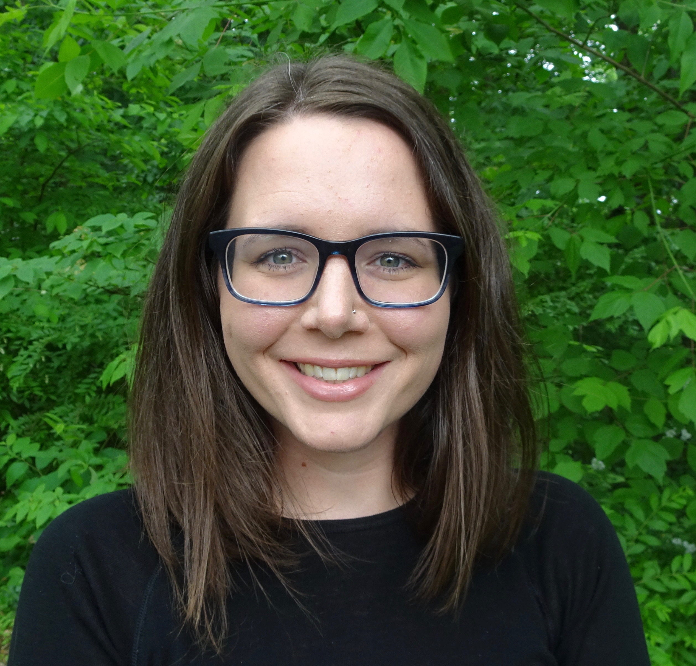

:::: {style="display: grid; grid-template-columns: 1fr 1fr; grid-column-gap: 30px;"}

::: {}

```{r, echo = FALSE, out.width='80%', fig.align='center'}

```


[Kelly McConville](http://mcconville.rbind.io/) is an Associate Professor of Statistics at [Reed College](https://www.reed.edu/math/) in Portland, Oregon.  Her methodological research involves incorporating novel modeling techniques into survey estimators.  She is currently spending her sabbatical as a Visiting Research Scientist at the Rocky Mountain Research Station of FIA.  With big help from Gretchen Moisen and Tracey Frescino, she runs an undergraduate research program and has mentored 24 undergraduate students with majors ranging from Statistics to English!  In addition to her regular teaching duties, she has taught several continuing education short courses, webinars, and workshops on `R` and various data science and statistics topics.  
:::


::: {}

```{r, echo = FALSE, out.width='80%', fig.align='center'}
knitr::include_graphics("dudesquare.png")
```

[Grayson White](https://graysonwhite.com/) is a Data Scientist contracting with FIA. While completing a mathematics-statistics degree at Reed College, he began working with FIA data as part of his undergraduate thesis and his findings served as the foundation for a [journal article on applying Bayesian estimators to small areas](https://www.frontiersin.org/articles/10.3389/ffgc.2021.752911/abstract). At FIA, Grayson primarily works with Tracey Frescino on the development of the `FIESTA` `R` package and on model-assisted and small area estimation research. In the near future, Grayson plans to attend graduate school in statistics and would love to continue collaborating with FIA as part of his dissertation work.
:::

::::


